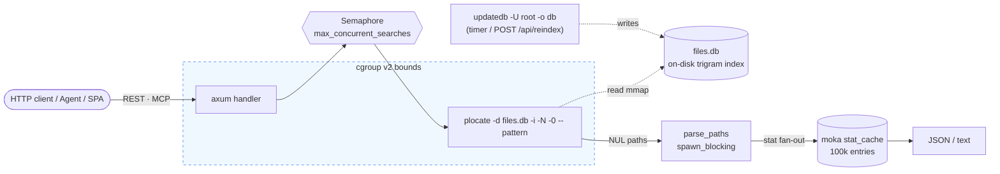

<div align="center">

# plocate-server

A RESTful **filename / path search** API server for very large file trees
(millions of files), backed by an on-disk [plocate](https://plocate.sesse.net/)
trigram index.

Sub-millisecond search · ~20 MiB RSS · cgroup-bounded · single-file static deploy

[](https://github.com/fanyang89/plocate-server/actions/workflows/ci.yml)
[](./LICENSE)
[](https://www.rust-lang.org/)
[](https://github.com/fanyang89/plocate-server/releases)

**[English](./README.md)** · [中文文档](./docs/zh/README.md)

</div>

---

## Why plocate-server

- **Blazing fast** — sub-millisecond even at 10M+ paths (measured p99 `3.84 ms`
  over 888k paths on SSD).
- **Tiny footprint** — the index lives on disk, never in RAM; steady-state RSS
  is ~20 MiB.
- **Good neighbour** — cgroup v2 bounded (`Nice=19`, `IOSchedulingClass=idle`,
  `CPUQuota=200%`), designed to run alongside a busy foreground service
  (e.g. `dufs`) without starving it.
- **One-file deploy** — fully-static musl binary via cargo-zigbuild; no libc,
  no runtime deps.
- **Three ways in** — REST API, auto-generated OpenAPI / Swagger UI, and MCP
  for AI agents.
- **Ships a UI** — embedded React SPA with debounced search, fuzzy ranking,
  and an MCP install dialog.

## Quick start

```bash
# Needs the plocate package on the host
sudo dnf install plocate     # Fedora / RHEL
sudo apt install plocate     # Debian / Ubuntu

# Run against your tree
cargo run --release -- --base-path /srv/files
```

The first start builds the index in the background; subsequent starts reuse
the on-disk index and serve immediately. Open:

```
http://127.0.0.1:8787        # SPA
http://127.0.0.1:8787/swagger-ui
```

```bash
# Try it
curl 'http://127.0.0.1:8787/api/search?q=invoice&limit=5'
curl 'http://127.0.0.1:8787/api/glob?pattern=*2024*.log'
curl 'http://127.0.0.1:8787/api/fuzzy?q=zookeeper%20rpm%20oe1'
```

## How it works



The server holds **no index in RAM** — it spawns short-lived `plocate` child
processes that mmap the on-disk index. `updatedb` refreshes that file
independently (systemd timer or `POST /api/reindex`). That separation is what
makes it safe to run alongside a busy file server.

## Documentation

| Topic | English | 中文 |
| --- | --- | --- |
| Install & first run | [getting-started](./docs/en/getting-started.md) | [快速上手](./docs/zh/getting-started.md) |
| All flags & env vars | [configuration](./docs/en/configuration.md) | [配置参考](./docs/zh/configuration.md) |
| REST endpoints | [api](./docs/en/api.md) | [API 参考](./docs/zh/api.md) |
| MCP tools for agents | [mcp](./docs/en/mcp.md) | [MCP 集成](./docs/zh/mcp.md) |
| systemd · cgroup · packages | [deployment](./docs/en/deployment.md) | [部署运维](./docs/zh/deployment.md) |
| Architecture & internals | [architecture](./docs/en/architecture.md) | [架构原理](./docs/zh/architecture.md) |
| HDD tuning & latency | [hdd-tuning](./docs/en/hdd-tuning.md) | [HDD 调优](./docs/zh/hdd-tuning.md) |
| Bench harness & results | [benchmark](./docs/en/benchmark.md) | [性能基准](./docs/zh/benchmark.md) |

## Configuration

All flags have matching `PLOCATE_SERVER_*` env vars. Most-used:

| Flag | Env | Default |
| --- | --- | --- |
| `--base-path` | `PLOCATE_SERVER_BASE_PATH` | *(required)* |
| `--bind` | `PLOCATE_SERVER_BIND` | `127.0.0.1:8787` |
| `--db-path` | `PLOCATE_SERVER_DB_PATH` | `$XDG_DATA_HOME/plocate-server/files.db` |
| `--max-results` | `PLOCATE_SERVER_MAX_RESULTS` | `100` |
| `--max-concurrent-searches` | `PLOCATE_SERVER_MAX_CONCURRENT_SEARCHES` | `8` |
| `--public-base-url` | `PLOCATE_SERVER_PUBLIC_BASE_URL` | *(unset)* |
| `--file-server-url` | `PLOCATE_SERVER_FILE_SERVER_URL` | *(unset)* |

Full table (17 flags) → [configuration](./docs/en/configuration.md).

## Development

Requires Rust, [Task](https://taskfile.dev), and pnpm.

```bash
task check          # cargo check
task web-dev        # Vite dev server (proxies API to :8787)
task run            # cargo run (gnu dev build)
task build          # release musl binary (needs zig)
task packages       # RPM + pacman + deb via nfpm
```

Pre-commit checks run the same suite as CI — see
[AGENTS.md](./AGENTS.md) and [CONTRIBUTING notes](./docs/en/deployment.md#development-setup).

## License

Source code is licensed under the **MIT** License — see [LICENSE](./LICENSE).

Pre-built **distribution packages** (RPM / pacman / deb) bundle plocate,
which is **GPLv2+**, so the combined package is GPLv2+. The plocate-server
source itself remains MIT.
