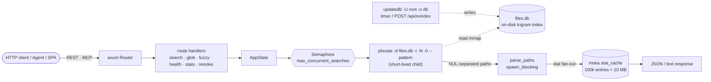

# Architecture

## Request flow

The index is produced independently by `updatedb -U <root> -o <db>`, run by
the systemd timer or `POST /api/reindex`. Because the index is a file, the
server process holds **no index in RAM** — its footprint is just the HTTP
runtime (~20 MiB RSS measured). That is what makes it safe to run alongside a
busy file server.

## Module map (`src/`)

| File | Responsibility |
| --- | --- |
| `main.rs` | Entrypoint. Sets `mimalloc` global allocator, inits tracing, parses `Config`, builds `AppState`, kicks off the initial `updatedb` if the db is missing, binds TCP, installs graceful shutdown. |
| `config.rs` | `clap` `Config` struct — all 17 `--flag` + `PLOCATE_SERVER_*` env vars. `resolved_db_path()` walks XDG → HOME → `/var/lib/plocate-server`. |
| `state.rs` | The engine (896 lines). Holds `base_path`, `db_path`, binary paths, the moka `stat_cache` (100k entries), a `Semaphore` for `max_concurrent_searches`, the reindex lock (`AtomicBool`), and `last_run`. Implements `search`, `search_fuzzy` (nucleo ranking), `run_plocate_multi`, and `trigger_reindex`. |
| `dto.rs` | Serde + utoipa `ToSchema` DTOs for every response. |
| `error.rs` | `AppError` → HTTP status mapping. |
| `limits.rs` | Shared input validation: query ≤256, offset ≤10000. |
| `mcp.rs` | MCP server via `rmcp` `StreamableHttpService`, mounted stateless at `/mcp`. Three tools: `search_files`, `glob`, `fuzzy_search`. |
| `openapi.rs` | utoipa `ApiDoc`; `openapi_with_server` populates the `servers` field when a prefix/URL is set. |
| `routes/mod.rs` | `router(state)`. Wires the inner Router (REST + SwaggerUi), nests `/mcp`, optionally nests under a prefix, installs the SPA fallback. |
| `routes/search.rs` | `search` / `glob` / `fuzzy` handlers + `IntoParams`. |
| `routes/health.rs` | `health`, `base_path`, `file_server`, `feedback`. Resolves binaries on `PATH`, reads db mtime+size. |
| `routes/stats.rs` | `stats` — PID, RSS/threads (`/proc/self/status`), db size/mtime, reindexing flag, last reindex. |
| `routes/reindex.rs` | `POST /api/reindex` — `200 started` / `202 already-running`. |
| `routes/frontend.rs` | `rust-embed` embeds `web/dist/`. SPA fallback; rewrites `index.html` with `<base href>` + `window.__BASE_PATH__` when a prefix is set. |

## Key design decisions

### Why no in-RAM index?

`plocate`'s trigram index is designed to be mmapped directly from disk — that
is where its sub-millisecond latency comes from. Re-implementing that in RAM
would (a) duplicate work the kernel page cache already does, (b) blow up RSS
proportional to corpus size, and (c) make restart expensive. By spawning
short-lived `plocate` child processes, the server keeps a ~20 MiB footprint
regardless of corpus size and starts instantly.

### Why spawn_blocking for the stat fan-out?

`plocate` returns NUL-separated paths only — it does not tag directories. To
fill the `type`/`kind` field (`file` vs `directory`) the server stats each
path. On a cold cache this is a synchronous `lstat` fan-out; doing it on the
tokio runtime would block reactor threads, so it runs inside
`spawn_blocking` with a deadline (`src/state.rs:249`). Results are memoized
in a moka cache (100k entries ≈ 10 MB), invalidated on every reindex.

This fan-out is the single biggest production risk on HDD — see
[hdd-tuning](./hdd-tuning.md).

### Why two separate timeouts?

- **`search-timeout-secs`** (default 10) — wall-clock per search. Exceeding
  returns `504`.
- **`queue-timeout-secs`** (default 5) — time spent waiting for a semaphore
  permit when `max-concurrent-searches` is saturated. Exceeding returns `503`.

They are distinct failure modes: a `503` means "the server is busy, retry
later"; a `504` means "this specific query is too slow".

### Why mimalloc?

`#[global_allocator] static GLOBAL: mimalloc::MiMalloc` (`src/main.rs:10`).
mimalloc gives better throughput and lower fragmentation than the system
allocator under the bursty allocation pattern of JSON serialization +
short-lived child-process piping, with no config.

### Why nucleo for fuzzy?

[nucleo-matcher](https://crates.io/crates/nucleo-matcher) is the same engine
behind Helix's fuzzy matcher — a Rust port of fzf's scoring, with path-aware
matching (`Config::DEFAULT.match_paths()`). It lets the server answer
multi-keyword queries like `zookeeper rpm oe1` that substring search cannot.

## Workspace layout

Cargo workspace (`Cargo.toml`):

- `.` — the `plocate-server` crate (`src/`, frontend embedded from `web/dist/`
  via rust-embed at release build time).
- `bench/` — the `rlt`-based load-testing harness; binary `bench`, run via
  `task bench-*`. See [benchmark](./benchmark.md).

Always use `cargo <cmd> -p <crate>` (or `--all`) — bare `cargo <cmd>` in a
workspace dir picks an ambiguous default.
