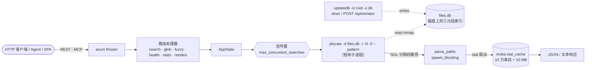

# 架构原理

## 请求流程

索引由 `updatedb -U <root> -o <db>` 独立产出，由 systemd timer 或
`POST /api/reindex` 触发。因为索引是文件，服务器进程 **不在内存中持有
索引** —— 它的占用只有 HTTP 运行时（实测 ~20 MiB RSS）。这正是它能安全地
与繁忙文件服务并存的原因。

## 模块图（`src/`）

| 文件 | 职责 |
| --- | --- |
| `main.rs` | 入口。设 `mimalloc` 全局分配器、初始化 tracing、解析 `Config`、构建 `AppState`、db 缺失时拉起首次 `updatedb`、绑定 TCP、安装优雅关停。 |
| `config.rs` | `clap` `Config` 结构 —— 全部 17 个 `--flag` + `PLOCATE_SERVER_*` 环境变量。`resolved_db_path()` 按 XDG → HOME → `/var/lib/plocate-server` 顺序解析。 |
| `state.rs` | 引擎核心（896 行）。持有 `base_path`、`db_path`、二进制路径、moka `stat_cache`（10 万条目）、`max_concurrent_searches` 信号量、reindex 锁（`AtomicBool`）和 `last_run`。实现 `search`、`search_fuzzy`（nucleo 排序）、`run_plocate_multi`、`trigger_reindex`。 |
| `dto.rs` | 每个响应的 Serde + utoipa `ToSchema` DTO。 |
| `error.rs` | `AppError` → HTTP 状态码映射。 |
| `limits.rs` | 通用输入校验：query ≤256、offset ≤10000。 |
| `mcp.rs` | 经 `rmcp` `StreamableHttpService` 的 MCP 服务器，无状态挂载到 `/mcp`。三个工具：`search_files`、`glob`、`fuzzy_search`。 |
| `openapi.rs` | utoipa `ApiDoc`；设置前缀/URL 时 `openapi_with_server` 填充 `servers` 字段。 |
| `routes/mod.rs` | `router(state)`。组装内层 Router（REST + SwaggerUi），嵌套 `/mcp`，可选地嵌套到前缀下，安装 SPA 兜底。 |
| `routes/search.rs` | `search` / `glob` / `fuzzy` 处理器 + `IntoParams`。 |
| `routes/health.rs` | `health`、`base_path`、`file_server`、`feedback`。在 `PATH` 上解析二进制、读取 db mtime+size。 |
| `routes/stats.rs` | `stats` —— PID、RSS/线程数（`/proc/self/status`）、db 大小/mtime、reindexing 标志、上次 reindex。 |
| `routes/reindex.rs` | `POST /api/reindex` —— `200 已启动` / `202 已在运行`。 |
| `routes/frontend.rs` | `rust-embed` 嵌入 `web/dist/`。SPA 兜底；设置前缀时用 `<base href>` + `window.__BASE_PATH__` 重写 `index.html`。 |

## 关键设计决策

### 为什么索引不进内存？

`plocate` 的三元组索引天生就是从磁盘 mmap 读取的 —— 它的亚毫秒延迟正源于
此。把它在内存里重做一遍会：（a）重复内核页缓存已经做的事，（b）让 RSS
随语料库线性膨胀，（c）让重启变昂贵。通过拉起短命的 `plocate` 子进程，
服务器无论语料库多大都保持 ~20 MiB 占用，并即时启动。

### 为什么 stat 扇出要用 spawn_blocking？

`plocate` 只返回 NUL 分隔的路径 —— 不标记目录。为了填 `type`/`kind` 字段
（`file` 还是 `directory`），服务器要 stat 每条路径。缓存冷时这是一次同步
`lstat` 扇出；在 tokio 运行时上做会阻塞反应器线程，所以它跑在
`spawn_blocking` 里并带截止时间（`src/state.rs:249`）。结果 memoize 到
moka 缓存（10 万条目 ≈ 10 MB），每次 reindex 后失效。

这个扇出是 HDD 上最大的生产风险 —— 见 [HDD 调优](./hdd-tuning.md)。

### 为什么有两套超时？

- **`search-timeout-secs`**（默认 10）—— 单次搜索的墙钟时间。超时返回
  `504`。
- **`queue-timeout-secs`**（默认 5）—— `max-concurrent-searches` 饱和时
  等待信号量许可的时间。超时返回 `503`。

两者是不同的失败模式：`503` 意味着"服务器忙，稍后再试"；`504` 意味着
"这条查询本身太慢"。

### 为什么用 mimalloc？

`#[global_allocator] static GLOBAL: mimalloc::MiMalloc`（`src/main.rs:10`）。
在 JSON 序列化 + 短命子进程管道这种突发分配模式下，mimalloc 相比系统分配
器有更好的吞吐和更低的碎片，且无需配置。

### 为什么模糊匹配用 nucleo？

[nucleo-matcher](https://crates.io/crates/nucleo-matcher) 是 Helix 模糊匹配
器背后的同一引擎 —— fzf 打分算法的 Rust 移植，支持路径感知匹配
（`Config::DEFAULT.match_paths()`）。它让服务器能回答像
`zookeeper rpm oe1` 这种子串搜索无法处理的多关键词查询。

## 工作区布局

Cargo 工作区（`Cargo.toml`）：

- `.` —— `plocate-server` crate（`src/`，前端在 release 构建时通过
  rust-embed 从 `web/dist/` 嵌入）。
- `bench/` —— 基于 `rlt` 的压测工具；二进制 `bench`，通过 `task bench-*`
  运行。详见 [性能基准](./benchmark.md)。

始终用 `cargo <cmd> -p <crate>`（或 `--all`）—— 在工作区目录里裸
`cargo <cmd>` 会选到有歧义的默认成员。
